# SoloRealm

SoloRealm is an automation puzzle, solitaire-like game.

## Head first 

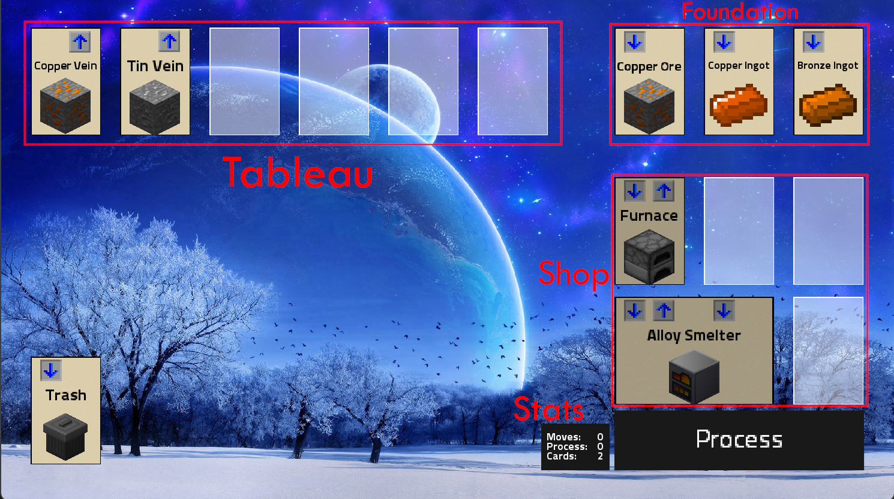

### TL;DR
**Complete a level by completing the foundation. Unlock new machines in the shop
to process more ingredients. Places machines in the Tableau to process ingredients.**

The solitaire game screen is divided in multiple parts.

In the center, there is the Tableau, this is the main part. Machine cards can be placed
in the tableau to process ingredients.

In the top right, the foundation is the core of a level. A foundation card needs the corresponding
ingredients to unlock shop row. The most right is the final foundation card and finish the level
where the corresponding ingredient is placed.

The shop unlocks new machines to help you progress through a level. Each row is unlocked by completing
a foundation card.

Stats display your stats for each level.
Moves are incremented by moving machine cards or ingredients.
Process count is incremented for each time the process button is clicked.
Cards are incremented when there is a new card on the tableau.

On the bottom right, the Process button process machines in the tableau.

The trash gives you the possibility of voiding machines or ingredients in case of soft lock.

### Machine Card
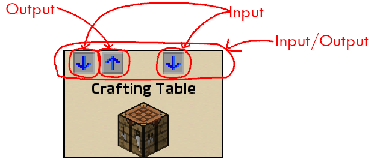

Machine Card can have multiple input/output slot.
The input slot is the downward arrow. The output arrow is upward arrow.
Ingredients are placed in the input slot.
Machine cards can span multiple columns.

### Stacking Machines
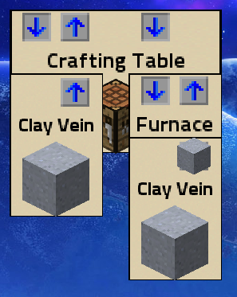

Machines cards can be stacked like this. Machines with more than one column can stack
multiple machines.

### Ingredients
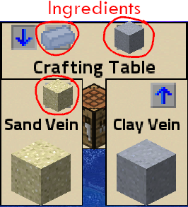

Ingredients are the basic components of the game, alongside machines. Ingredients are placed in input/
output of machines cards.
Ingredients are moved by dragging them.

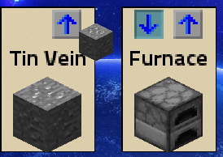

When an ingredient is dragged, the valid input slots turn cyan.

### Process
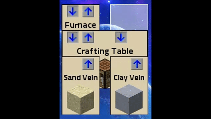

When the process button is pressed, machines process their ingredients.
A machine with a completed correct recipe, input ingredients are consumed to create the
corresponding output.
When a machine output is placed on top of a machine with an input matching the result recipe,
the ingredient is moved to the bottom machine.

### Completing foundation and unlocking shop row
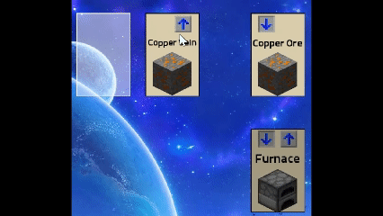

When a correct valid ingredient is placed in the foundation input slot,
a row of the shop is unlocked. machines from the shop are available infinitely. 

### Hints
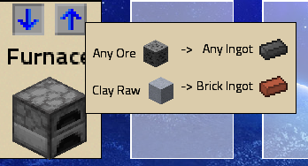

By right-clicking a machine, available process is show.
Recipes can have an "any" wild card, like in the furnace recipe.

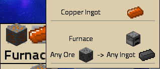

Right-clicking is also available with ingredients, showing what ingredient is this.

### Exiting a level

By pressing 'Esc' key, the level can be exited.  

### Menu screen
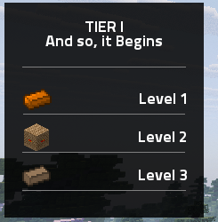

On the left of the menu screen is a list of levels.
When a level is clicked, the level is loaded and ready to be played.

### Stat Screen
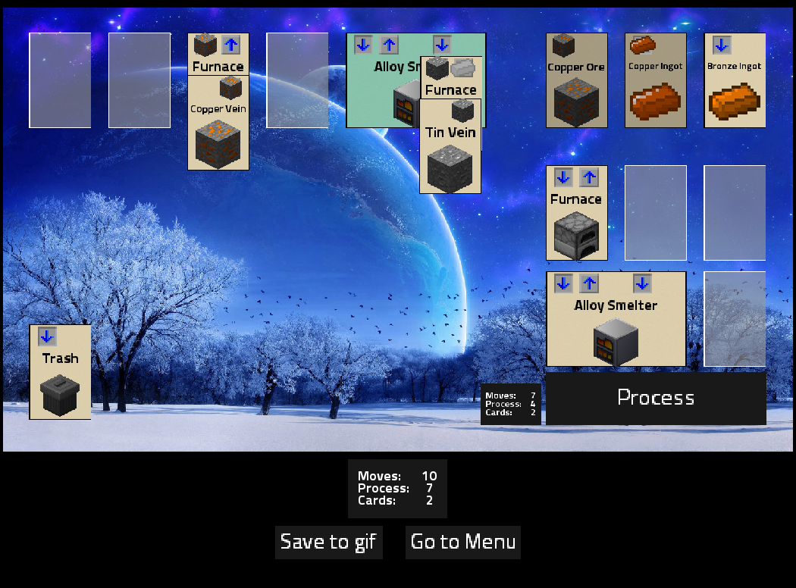

After completing a level, the stat screen will show the game step by step with the Save to gif button.
This gif can be saved into the download folder.
The final stat Tableau is show.
The Go to Menu is available. 

# Building the project

SoloRealm require Java 21. SoloRealm uses Gradle. Gradle tasks used gradlew.bat or ./gradlew commands.
Creating the game jar require the `:lwjgl3:dist` flag. The jar file is then created
in the `lwjgl3/build/libs` folder.
```cmd
./gradlew :lwjgl3:dist
```
